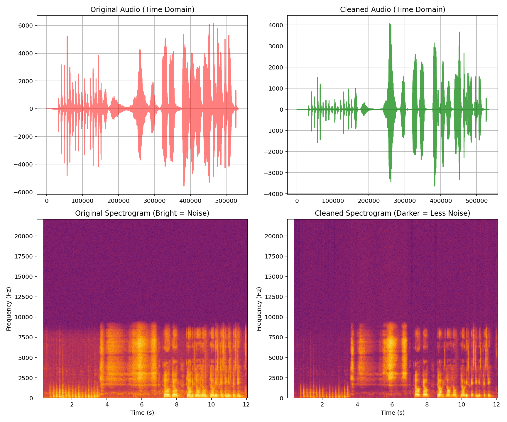

# Audio Noise Suppression using Python & DSP 🎧

This project demonstrates a practical application of Digital Signal Processing (DSP) by implementing **Spectral Gating** to remove background noise from audio signals.

## 🎯 Project Goal
To record real-world noisy audio (voice + environmental noise) and computationally separate the signal from the noise using Python.

## 📊 Results
The algorithm successfully identified the stationary noise profile and attenuated it while preserving the human voice frequencies.

## 🛠️ Tech Stack
- **Language:** Python
- **Libraries:** SciPy, NumPy, Matplotlib, Noisereduce

## 🚀 How to Run
1. Install dependencies: `pip install -r requirements.txt`
2. Record a file named `real_noise.wav`.
3. Run the script: `python main.py`
